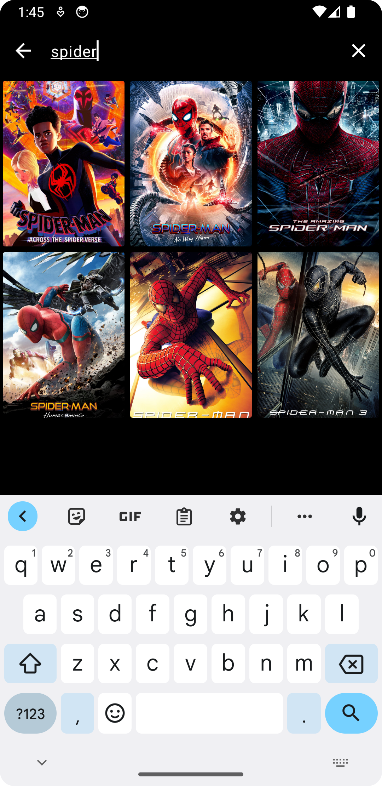
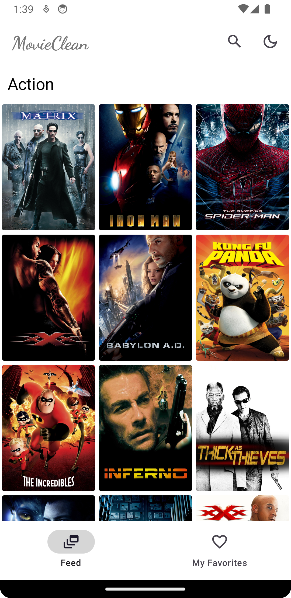
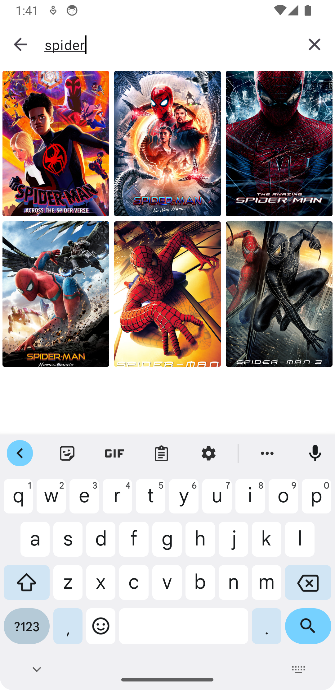

# Android Clean Architecture [](https://app.codacy.com/gh/AliAsadi/Android-Clean-Architecture?utm_source=github.com&utm_medium=referral&utm_content=AliAsadi/Android-Clean-Architecture&utm_campaign=Badge_Grade_Settings)

A sample Android application that uses the clean architecture approach and is written in Kotlin💯.

### The Motivation behind the app
This repository was created with the intention of stepping outside of my comfort zone as much as possible, tackling topics outside of my area of expertise, and using it to implement new challenges and ideas.


| Mode  | Feed | Favorites | Movie Details | Search |
|-------|------|-----------|--------------|----------|
| Dark |  |  |  |  |
| Light |  |  |  |  |


| Orientation  | Feed | 
|-------|------|
| Landscape |  |


# Architecture

The core principles of the clean approach can be summarized as followed:

#### 1. The application code is separated into layers.

These layers define the separation of concerns inside the code base.

#### 2. The layers follow a strict dependency rule.

Each layer can only interact with the layers below it.

#### 3. As we move toward the bottom layer — the code becomes generic.

The bottom layers dictate policies and rules, and the upper layers dictate implementation details such as the database, networking manager, and UI.


<p align="center">

</p>


# Structure
<p align="center">

</p>

#### Used libraries:
* [Coroutines](https://kotlinlang.org/docs/reference/coroutines-overview.html)
* [Hilt](https://developer.android.com/training/dependency-injection/hilt-android)
* [Retrofit2](https://github.com/square/retrofit)
* [View Binding](https://developer.android.com/topic/libraries/view-binding)
* [Mockito](https://github.com/mockito/mockito)
* [Android Architecture Components (ViewModels, LiveData, Room, etc.)](https://developer.android.com/topic/libraries/architecture/index.html)

--------------------------------------------------------------------------------------------

**Feel free to submit any type of issues and suggestions for improving the coding standard**

**Happy Coding!!!** 

--------------------------------------------------------------------------------------------

### License
```
   Copyright (C) 2020 Ali Asadi
   Licensed under the Apache License, Version 2.0 (the "License");
   you may not use this file except in compliance with the License.
   You may obtain a copy of the License at

       http://www.apache.org/licenses/LICENSE-2.0

   Unless required by applicable law or agreed to in writing, software
   distributed under the License is distributed on an "AS IS" BASIS,
   WITHOUT WARRANTIES OR CONDITIONS OF ANY KIND, either express or implied.
   See the License for the specific language governing permissions and
   limitations under the License.
```

### Contributing
Just make pull request. You are in!
