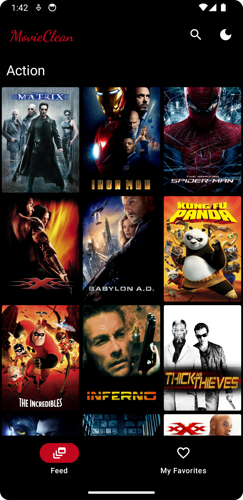

# Android Clean Architecture

[](https://app.codacy.com/gh/AliAsadi/Android-Clean-Architecture?utm_source=github.com&utm_medium=referral&utm_content=AliAsadi/Android-Clean-Architecture&utm_campaign=Badge_Grade_Settings)

### A basic sample android application to understand Clean Architecture in a very simple way and is written in Kotlin. Just clone, build, run and understand.

# Architecture
<p align="center">

</p>

# Structure
<p align="center">

</p>


### Screenshot

| Mode  | Feed | Favorites | Movie Details | Search |
|-------|------|-----------|--------------|----------|
| Dark |  |  |  |  |
| Light |  |  |  |  |


* Landscape

 |


#### Used libraries:
* [Coroutines](https://kotlinlang.org/docs/reference/coroutines-overview.html)
* [Hilt](https://developer.android.com/training/dependency-injection/hilt-android)
* [Retrofit2](https://github.com/square/retrofit)
* [View Binding](https://developer.android.com/topic/libraries/view-binding)
* [Mockito](https://github.com/mockito/mockito)
* [Android Architecture Components (ViewModels, LiveData, Room, etc.)](https://developer.android.com/topic/libraries/architecture/index.html)

--------------------------------------------------------------------------------------------

**Feel free to submit any type of issues and suggestions for improving the coding standard**

**Happy Coding!!!** 

--------------------------------------------------------------------------------------------

### License
```
   Copyright (C) 2020 Ali Asadi
   Licensed under the Apache License, Version 2.0 (the "License");
   you may not use this file except in compliance with the License.
   You may obtain a copy of the License at

       http://www.apache.org/licenses/LICENSE-2.0

   Unless required by applicable law or agreed to in writing, software
   distributed under the License is distributed on an "AS IS" BASIS,
   WITHOUT WARRANTIES OR CONDITIONS OF ANY KIND, either express or implied.
   See the License for the specific language governing permissions and
   limitations under the License.
```

### Contributing
Just make pull request. You are in!
