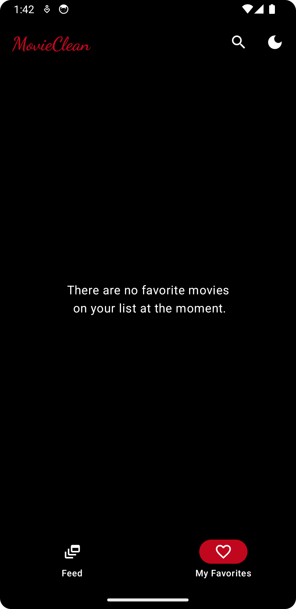
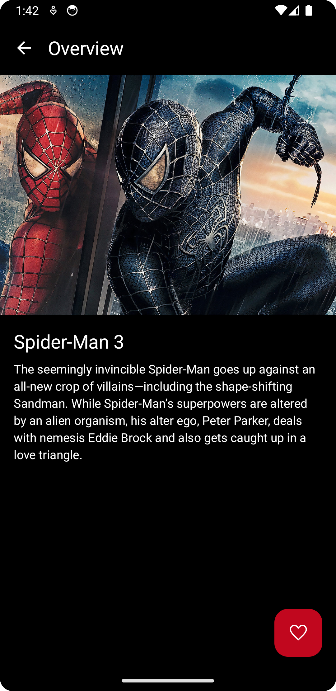
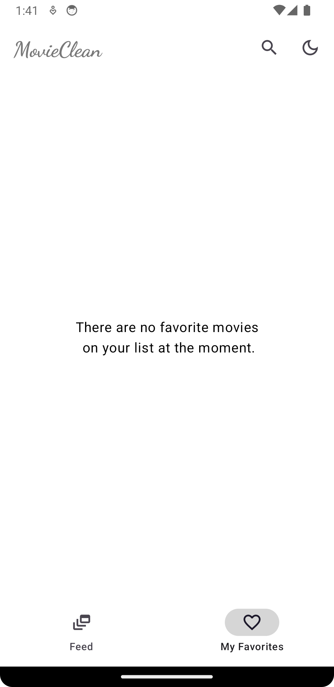

# Android Clean Architecture [](https://app.codacy.com/gh/AliAsadi/Android-Clean-Architecture?utm_source=github.com&utm_medium=referral&utm_content=AliAsadi/Android-Clean-Architecture&utm_campaign=Badge_Grade_Settings)

A demo movie android app that demonstrates Clean Architecture and is written in Kotlin.💯🎞 

### The Motivation behind the app
This repository was created with the intention of stepping outside of my comfort zone as much as possible, tackling topics outside of my area of expertise, and using it to implement new challenges and ideas.

API: https://movies-mock-server.vercel.app/

API (Repository): https://github.com/AliAsadi/movies-mock-server

### ⚠️NOTE

Architecture by its nature is **dynamic** and **ever-evolving**, there are always several solutions to every problem, and what works best will depend on the specific requirements and constraints of your project.


# Screenshots
| Mode  | Feed | Favorites | Movie Details | Search |
|-------|------|-----------|--------------|----------|
| Dark |  |  |  |  |
| Light |  |  |  |  |


| Orientation  | Feed | 
|-------|------|
| Landscape |  |


# Clean Architecture

The core principles of the clean approach can be summarized as followed:

#### 1. The application code is separated into layers.

These layers define the separation of concerns inside the code base.

#### 2. The layers follow a strict dependency rule.

Each layer can only interact with the layers below it.

#### 3. As we move toward the bottom layer — the code becomes generic.

The bottom layers dictate policies and rules, and the upper layers dictate implementation details such as the database, networking manager, and UI.

<p align="center">

</p>

# Architecture Layers

The application consists of three layers:

The domain layer, the data layer, and the presentation layer.

Looking at project’s high-level structure, you’ll see that each layer is represented by a module in the project.


I like it because it helps me avoid accidentals “leaks” between the layers.


# Structure
<p align="center">

</p>

## Built With 🛠
- [Kotlin](https://kotlinlang.org/) - First class and official programming language for Android development.
- [Coroutines](https://kotlinlang.org/docs/reference/coroutines-overview.html) - For asynchronous and more..
- [Flow](https://kotlin.github.io/kotlinx.coroutines/kotlinx-coroutines-core/kotlinx.coroutines.flow/-flow/) - A cold asynchronous data stream that sequentially emits values and completes normally or with an exception.
- [Android Architecture Components](https://developer.android.com/topic/libraries/architecture) - Collection of libraries that help you design robust, testable, and maintainable apps.
  - [LiveData](https://developer.android.com/topic/libraries/architecture/livedata) - Data objects that notify views when the underlying database changes.
  - [ViewModel](https://developer.android.com/topic/libraries/architecture/viewmodel) - Stores UI-related data that isn't destroyed on UI changes.
  - [ViewBinding](https://developer.android.com/topic/libraries/view-binding) - Generates a binding class for each XML layout file present in that module and allows you to more easily write code that interacts with views.
- [Dependency Injection](https://developer.android.com/training/dependency-injection)
  - [Hilt](https://dagger.dev/hilt) - Easier way to incorporate Dagger DI into Android application.
- [Retrofit](https://square.github.io/retrofit/) - A type-safe HTTP client for Android and Java.
- [Mockito](https://github.com/mockito/mockito) - For Mocking and Unit Testing

--------------------------------------------------------------------------------------------

**Feel free to submit any type of issues and suggestions for improving the coding standard**

**Happy Coding!!!** 

--------------------------------------------------------------------------------------------

### License
```
   Copyright (C) 2020 Ali Asadi
   Licensed under the Apache License, Version 2.0 (the "License");
   you may not use this file except in compliance with the License.
   You may obtain a copy of the License at

       http://www.apache.org/licenses/LICENSE-2.0

   Unless required by applicable law or agreed to in writing, software
   distributed under the License is distributed on an "AS IS" BASIS,
   WITHOUT WARRANTIES OR CONDITIONS OF ANY KIND, either express or implied.
   See the License for the specific language governing permissions and
   limitations under the License.
```

### Contributing
Just make pull request. You are in!
